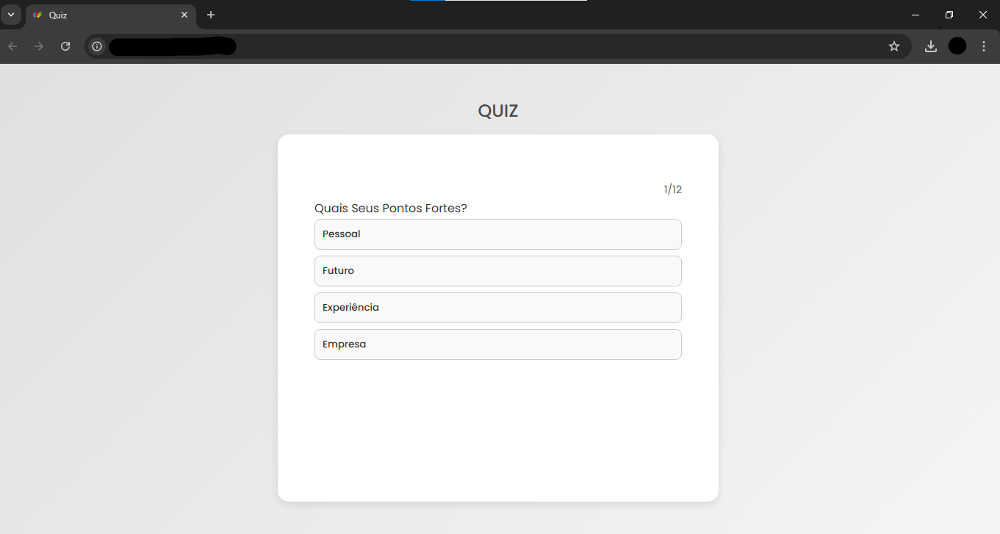

# Projeto de Quiz Interativo

Este é um projeto de quiz interativo, desenvolvido em HTML, CSS e JavaScript, que permite aos usuários responderem perguntas e verificarem suas respostas. O layout é organizado para uma interface intuitiva e estilizada, com botões responsivos e efeitos visuais atraentes.

## 🎨 Demonstração



## Índice
- [Funcionalidades](#funcionalidades)
- [Instalação](#instalação)
- [Funcionalidade](#funcionalidade)
- [Tecnologias Utilizadas](#tecnologias-utilizadas)
- [Estrutura do Projeto](#estrututra-do-projeto).
- [Pré-requisitos](#pre-requisitos).
- [Como usar](#como-usar);
- [Tecnologias Utilizadas](#tecnologias-utilizadas).
- [Contribuição](#contriubição).

## Funcionalidades

- Exibe uma pergunta por vez.
- Feedback imediato para respostas corretas e incorretas.
- Exibição da resposta correta quando uma opção errada é escolhida.
- Contagem de acertos ao final do quiz.
- Botão para reiniciar o quiz após a conclusão.

## Instalação

Para rodar o projeto localmente, siga os passos abaixo:

1. Clone o repositório:
   ```bash
   git clone https://github.com/EduardoVizoni/QuizJS.git
2. Navegue até a pasta do projeto:
   ```bash
    cd QuizJS
3. Abra o arquivo index.html no seu navegador para iniciar o quiz.

## 🚀 Funcionalidades

- Interface intuitiva com organização de perguntas e respostas em duas colunas.
- Estilo visual moderno com CSS personalizado.
- Feedback visual para respostas corretas e incorretas.
- Botão de reinício para recomeçar o quiz após finalizá-lo.

## 📁 Estrutura do Projeto

```plaintext
📂 projeto-quiz
├── index.html         # Estrutura principal do quiz
├── style.css          # Estilos do quiz
├── questions.js       # Questões do quiz
├── script.js          # Lógica do quiz em JavaScript
└── README.md          # Documentação do projeto
```

## 📋 Pré-requisitos
Para visualizar e editar o projeto, você precisará de um navegador da web e de um editor de código, como o [Visual Studio Code](https://code.visualstudio.com/).


## 🎉 Como Usar
Leia a pergunta exibida no topo da interface.
Clique na resposta que você acha que está correta entre as opções disponíveis.
Receba feedback imediato sobre a resposta.
No final, clique no botão "Reiniciar" para jogar novamente.

## 📌 Tecnologias Utilizadas


## 📝 Contribuição
Desenvolvido por:
- [Eduardo Vizoni do Prado](https://github.com/EduardoVizoni)
- [Gustavo de Souza](https://github.com/gstSenai)
- [Kauan Martim Soares](https://github.com/KauanMartim)
- [Nathan João Lima](https://github.com/nathanjoao)
